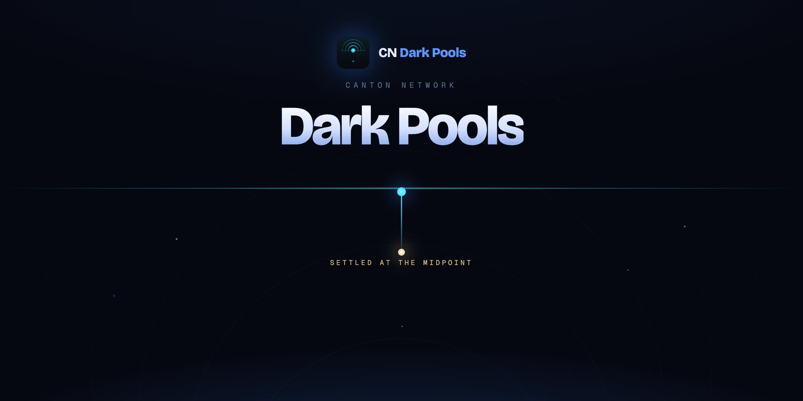
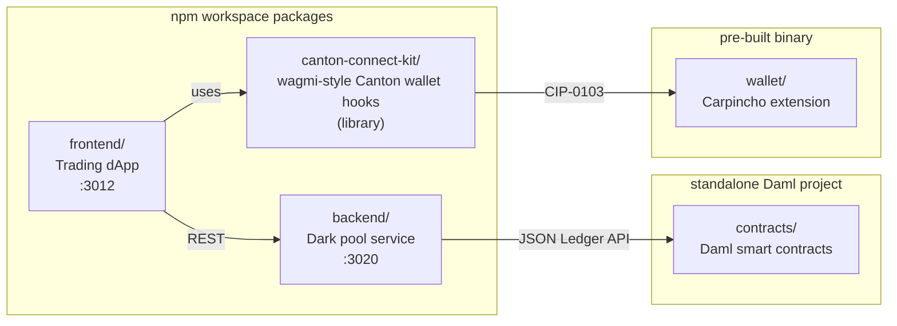

<p align="center">
  
</p>

# CN Dark Pools

A dark pool trading venue built on the Canton Network. Traders place private limit orders; the venue pairs crossing orders and settles them atomically at the midpoint price. The privacy comes from Canton's per-party data model: an order's only stakeholders are the trader and the venue, so nobody else can see the book.

Live at https://darkpools.cc/.

## Monorepo layout



You can explore the structure interactively at **[map.darkpools.cc](https://map.darkpools.cc/)**, a full atlas of the stack down to individual modules.

## Requirements

- Node.js >= 24
- npm >= 7
- Carpincho browser extension (see [`wallet/README.md`](wallet/README.md))
- Docker (for the containerized backend)
- `dpm` with SDK 3.4.11 + JDK 17+ (contracts only)

## Setup

```bash
npm install
```

One install links every workspace package. No per-package install step needed.

## Running the frontend

```bash
npm run app:dev
```

Opens at http://localhost:3012. Click **Connect Carpincho** and approve in the extension.

The frontend reads its data from the backend at `VITE_DARK_POOL_API` (defaults to `http://localhost:3020`).

## Running the backend

```bash
npm run backend:up       # Docker
# or, for local dev without Docker:
npm run backend:dev      # tsx watch
```

API at http://localhost:3020. Defaults to mock mode (in-memory ledger, no Canton node), see [`backend/README.md`](backend/README.md) for live-ledger configuration.

## Building the contracts

```bash
cd contracts
npm install      # vendors Daml dependencies + builds harness DARs
npm run build    # builds all four Daml packages
npm test         # runs the Daml Script test suite
```

See [`contracts/README.md`](contracts/README.md) for deployment.

## Common commands

```bash
npm run app:dev           # start the frontend dev server
npm run backend:dev       # start the backend with tsx watch (mock mode)
npm run backend:up        # build + start the backend Docker container
npm run backend:down      # stop the backend container
npm run backend:logs      # tail backend container logs
npm run backend:test      # run backend unit tests
npm run lint              # biome check across all workspace packages
npm run lint:fix          # auto-fix lint issues
npm run format            # biome format
```
