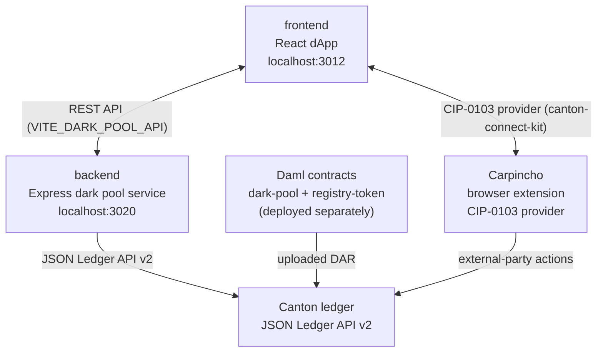

# Architecture Overview — CN Dark Pools

## Tech Stack

| Package | Stack |
|---------|-------|
| `frontend/` | Vite 6 + React 18 + Tailwind v4 + Radix UI + TanStack Router + framer-motion + `@canton-network/dapp-sdk` + `canton-connect-kit` |
| `backend/` | Node 24 + Express 5 + TypeScript; pure in-process matcher + scheduler; JSON Ledger API v2 client |
| `contracts/` | Daml (dpm SDK 3.4.11); four packages: `dark-pool`, `dark-pool-test`, `registry-token`, `registry-token-test` |
| `canton-connect-kit/` | TypeScript + React 18; wagmi-style hooks over the CIP-0103 provider surface |

## System Overview



In the current default configuration, the frontend runs against a `MockDarkPoolClient` (no backend needed) and the backend runs in `DARK_POOL_MOCK=1` mode (no ledger needed). The live path wires all four components together.

## Data Flow

The frontend has two views, both backed by `DarkPoolClient`:

- **Trader view** (`/`): place orders, watch own fills, check balances.
- **Venue view** (`/venue`): full resting book, manual match trigger, schedule controls.

The backend mirrors this with two read paths:

- `GET /trade?party=` returns the caller's own orders only.
- `GET /venue` returns the full book plus settled trades and scheduler state.

The matcher runs on a heartbeat (default 5 min) plus `POST /venue/match`. Each pass is a pure function: `findMatches(pool, orders, now) → MatchPlan[]`. Settlement executes each plan sequentially via `DarkPool_Match` on the Canton ledger.

## State Boundaries

- The frontend is stateless -- it polls the backend (or drives the mock) and renders.
- The backend holds an in-memory projection polled from the ledger ACS. The ledger is the source of truth. Trade history is in memory and resets on restart.
- The contracts enforce all economic rules on-ledger: price (midpoint), quantity bounds, minimum fills, settlement atomicity, remainder re-resting.
- Canton's per-party visibility model is the privacy mechanism: an `Order` contract's only stakeholders are the trader and the venue.

## Services and Ports

| Service | Port | Notes |
|---------|------|-------|
| frontend dev server | 3012 | `npm run app:dev` |
| backend (mock or live) | 3020 | `npm run backend:up` or `backend:dev` |

## Auth

| Variable | Owner | Purpose |
|----------|-------|---------|
| `DARK_POOL_MOCK` | `backend` env | `=1` enables fully offline mock mode |
| `CANTON_JSON_API_URL` | `backend` env | Live ledger JSON API endpoint |
| `CANTON_BACKEND_TOKEN` | `backend` env | Static bearer token for the Canton participant |
| `FIVENORTH_CLIENT_SECRET` | `backend` env | M2M OAuth secret (takes precedence over static token) |
| `DARK_POOL_BOOTSTRAP` | `backend` env | Path to `dark-pool.bootstrap.json` (parties, pool, factory, instruments) |
| `VITE_DARK_POOL_API` | `frontend` env | Backend base URL (e.g., `http://localhost:3020`) |
| `VITE_WC_PROJECT_ID` | `frontend` env | WalletConnect project ID (optional) |

Auth precedence in the backend: `DARK_POOL_MOCK=1` → mock; `CANTON_BACKEND_TOKEN` → static JWT; `FIVENORTH_CLIENT_SECRET` → M2M token exchange.

## Contracts Package Layout

```text
contracts/
  daml/
    dark-pool/              production venue templates (dark-pool only; no Amulet imports)
      DarkPool.daml         DarkPool, Order, FillAuthority templates
      DarkPool/Math.daml    pure pricing, rounding, crossing arithmetic
    dark-pool-test/         Daml Script tests + TestToken mock registry
    registry-token/         standalone production token registry (Holding + Allocation + Registry)
    registry-token-test/    Daml Script tests for registry-token
  docs/
    ARCHITECTURE.md         deep-dive into templates, the Match transaction, and deployment topologies
    registry-token.md       registry-token build and deploy guide
```

See [`contracts/docs/ARCHITECTURE.md`](contracts/docs/ARCHITECTURE.md) for the full design deep-dive: party trust model, the `FillAuthority` settlement chain, funding validation, privacy analysis, and deployment topologies.

## Orchestration

| Command | What it does |
|---------|-------------|
| `npm run app:dev` | Start frontend dev server |
| `npm run backend:dev` | Start backend with `tsx watch` (mock mode by default) |
| `npm run backend:up` | Build + start backend Docker container |
| `npm run backend:down` | Stop backend container |
| `npm run backend:logs` | Tail backend container logs |
| `npm run backend:test` | Run backend unit + integration tests |
| `cd contracts && npm run build` | Build all Daml packages |
| `cd contracts && npm test` | Run Daml Script test suite |

For detailed bring-up, see [`README.md`](README.md).
