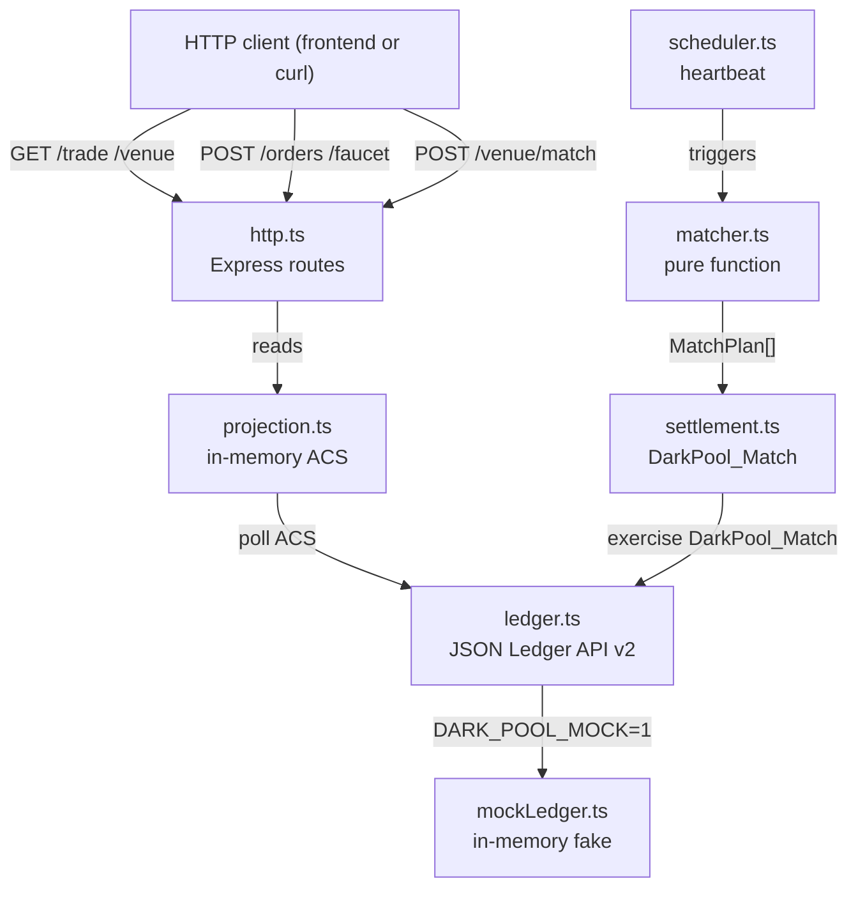

# Architecture Overview — backend

Off-ledger dark pool service. Single Express 5 process; in-process matcher and scheduler; JSON Ledger API v2 client. Runs fully offline in mock mode.

## Module Map

```
src/
  server.ts         HTTP server entry point; wires app and starts scheduler
  wiring.ts         dependency injection -- assembles all modules
  config.ts         resolves env vars and auth source
  auth.ts           static / M2M / mock bearer token provider
  types.ts          shared domain types (Order, Fill, Pool, Balance, MatchPlan, etc.)
  decimal.ts        exact 10-dp arithmetic via scaled BigInt (no floating point)
  http.ts           Express routes (all endpoints)
  ledger.ts         JSON Ledger API v2 client (exercise, ACS queries)
  projection.ts     in-memory ACS → order book, fills, balances (polled from ledger)
  matcher.ts        pure function: findMatches(pool, orders, now) → MatchPlan[]
  funding.ts        holding selection for order placement
  commands.ts       pure command builders (DarkPool_Match exercise payloads)
  settlement.ts     DarkPool_Match submission + fail-closed handling
  scheduler.ts      heartbeat loop + runPass() (the single writer)
  mockLedger.ts     in-memory fake ledger for DARK_POOL_MOCK=1
  mock-bootstrap.json  fixture parties, pool, and instruments for mock mode
```

## Request Lifecycle



## Matching Engine

`matcher.ts` is a pure function with no I/O:

```
findMatches(pool, orders, now) → MatchPlan[]
```

Per pool: filters to non-expired in-pool orders; sorts buys by price desc (ties: oldest offset first) and sells by price asc (same tiebreak); for each buy, takes the first unused sell from a different trader whose limits cross; keeps the pair only if `min(buyQty, sellQty)` satisfies both `minFill` values and the pool's `minFillFloor`; emits `{ buyOrderCid, sellOrderCid, fillQty }`.

Every emitted plan satisfies the on-ledger contract preconditions. A settlement failure therefore means a genuine race (funding moved, order cancelled), not a matcher logic error.

## Scheduler

`scheduler.ts` owns a single `runPass()` function guarded by a `running` flag (overlapping passes return `{ skipped: true }`). Each pass:

1. Refresh the projection (poll ACS)
2. Run `findMatches` → plans
3. Settle each plan sequentially via `settlement.ts`
4. Sweep expired orders via `Order_Reject`
5. Re-arm the heartbeat timer to `now + intervalMs`

`POST /venue/match` calls `runPass()` immediately and re-arms the timer. `PUT /venue/schedule` changes `intervalMs` and re-arms.

## Mock Mode

`DARK_POOL_MOCK=1` swaps `ledger.ts` for `mockLedger.ts`. The mock maintains an in-memory state seeded from `mock-bootstrap.json`, implements the same ACS query and exercise interface, and runs the full 35-test suite without a Canton node.

## API Surface

Port `3020`. See `API.md` for full request/response examples.

| Method · path | Purpose |
|---------------|---------|
| `GET /healthz` `/readyz` | Health checks |
| `GET /venue` | Full book + settled trades + scheduler state (operator) |
| `GET /trade?party=` | Own orders, fills, and balances (trader) |
| `POST /faucet` | Mint test tokens |
| `POST /orders` | Place a limit order |
| `DELETE /orders/:cid` | Cancel a resting order |
| `POST /venue/match` | Trigger a matching pass immediately |
| `PUT /venue/schedule` | Update the heartbeat interval |

For the frontend wiring guide (how to implement `HttpDarkPoolClient`), see `README.md` §6.
