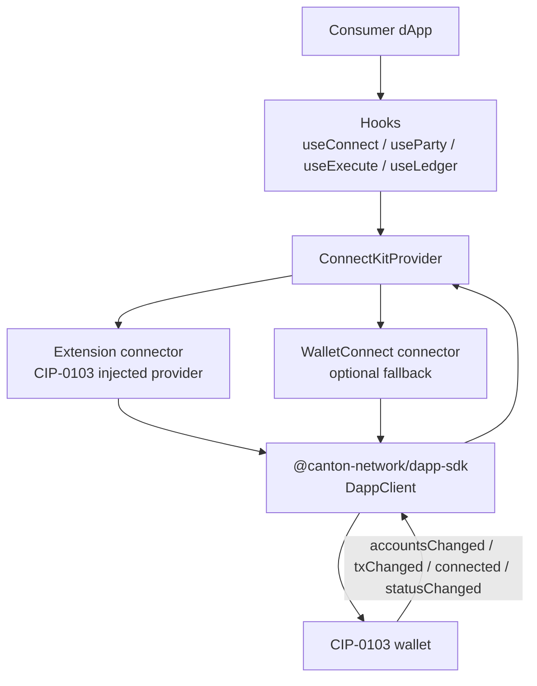

# Architecture Overview — canton-connect-kit

`canton-connect-kit` is the React adapter layer between Canton dApps and CIP-0103 wallets. It gives consumers wagmi-style hooks while normalizing two wallet transports: the injected browser extension provider and optional WalletConnect.

## Project Structure

```
src/
  ConnectKitProvider.tsx       React context, connection lifecycle, event wiring
  connectors/
    extension.ts               Injected CIP-0103 provider detection and event bridge
    walletconnect.ts           WalletConnect Sign Client fallback provider
  hooks/
    useConnect.ts              Connect/disconnect lifecycle
    useExecute.ts              prepareExecuteAndWait wrapper and tx state
    useLedger.ts               ledgerApi pass-through
    useParty.ts                active party state
    useSignMessage.ts          signMessage request state
    useWalletStatus.ts         lock/connect status state
  lib/
    walletAccount.ts           Wallet account normalization and primary selection
  types.ts                     Public config, connector, party, and status types
  index.ts                     Public package exports
```

## Data Flow



## Key Abstractions

### `ConnectKitProvider`

`ConnectKitProvider.tsx` owns all shared state: active `DappClient`, party, connection status, lock status, WalletConnect pairing URI, last transaction snapshot, and connection errors. Hooks should stay as readers over this context.

Connection modes:

- `extension`: require the injected browser provider.
- `walletconnect`: require `walletConnectProjectId` and pair through WalletConnect.
- `preferred`: try the extension first, then fall back to WalletConnect.

The provider wires wallet-pushed events once per connected client and tears them down on disconnect or unmount.

### Extension Connector

`connectors/extension.ts` uses `@canton-network/dapp-sdk`'s `ExtensionAdapter` to detect Carpincho through `canton:requestProvider` / `canton:announceProvider`.

Carpincho also emits `SPLICE_WALLET_EVENT` messages so wallet-pushed events can reach the canonical provider's `emit` path. The connector translates those page messages into provider events for `accountsChanged`, `txChanged`, `connected`, and `statusChanged`.

### WalletConnect Connector

`connectors/walletconnect.ts` implements a `Provider` around `@walletconnect/sign-client`. The Sign Client is dynamically imported so extension-only consumers do not load WalletConnect code.

The connector maps canonical CIP-0103 requests onto `canton_*` WalletConnect methods and forwards `session_event` messages to provider listeners.

### Hooks

Each hook exposes one consumer-facing concern:

| Hook | Responsibility |
|------|----------------|
| `useConnect` | Start/stop the active wallet connection and expose pairing / error state. |
| `useParty` | Return the current primary party and connection status. |
| `useWalletStatus` | Return lock/connect status derived from wallet events. |
| `useSignMessage` | Wrap `signMessage` as a promise lifecycle. |
| `useExecute` | Wrap `prepareExecuteAndWait` and expose transaction status updates. |
| `useLedger` | Expose raw `ledgerApi` for reads not covered by higher-level hooks. |

## Boundaries

This package must not depend on the `frontend/` dApp or any wallet internals. Its stable boundary is the CIP-0103 provider surface plus `@canton-network/dapp-sdk`.

For the full local stack around this package, see the root [`architecture.md`](../architecture.md).
