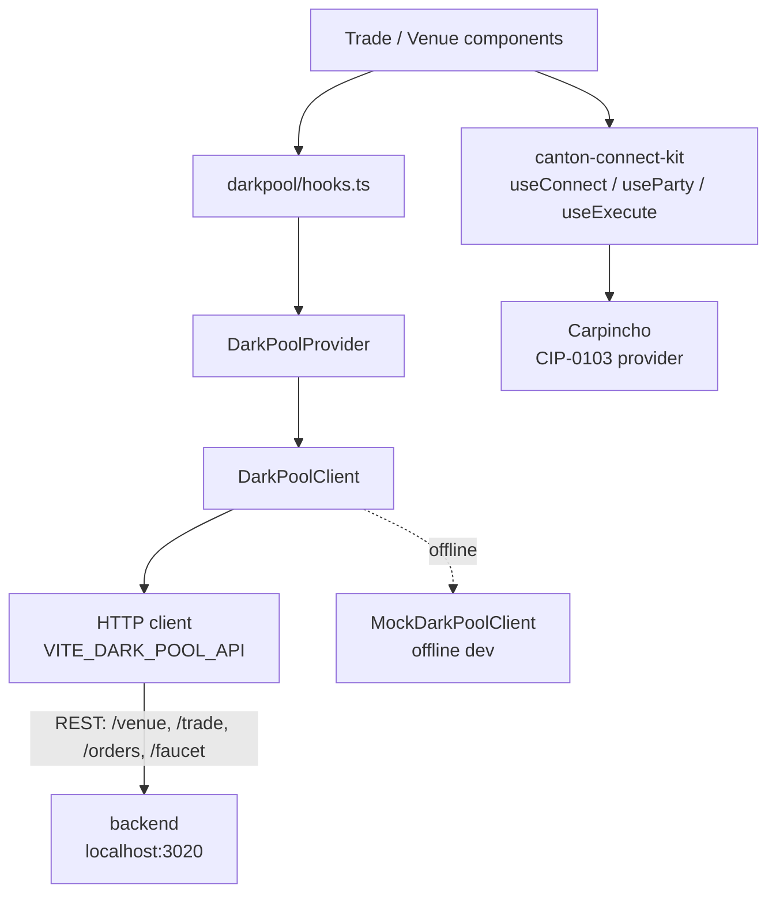

# Architecture Overview: frontend

The trading dApp. Built with Vite + React 18 + Tailwind v4 + TanStack Router. Two views: trader (`/`) and venue (`/venue`). Both read from the `DarkPoolClient` interface, which talks to the `backend/` dark pool service over REST. A mock client implementing the same interface backs offline development. Deployed at https://darkpools.cc/.

## Project Structure

```
src/
  main.tsx                  app entry point; mounts providers and the router
  App.tsx                   app shell, route tree wiring, provider composition
  ConnectionBar.tsx         wallet connect/disconnect bar (Carpincho)
  runtimeConfig.ts          network + wallet-companion URL, persisted to localStorage
  index.css                 Tailwind v4 entry + theme tokens
  routeTree.gen.ts          generated TanStack Router tree (do not edit)
  routes/
    __root.tsx              root layout route
    index.tsx               trader view (/)
    venue.tsx               venue view (/venue)
  darkpool/
    types.ts                DarkPoolClient interface; Order, Fill, Trade, Pool, Balance types
    darkpoolMath.ts         pricing / crossing / fill arithmetic (tested)
    format.ts               amount, price, quantity, and time formatting (tested)
    ledgerCommands.ts       builds Daml commands for wallet-executed actions (tested)
    hooks.ts                React hooks over the client (usePools, useBalances, useTrades, useMyFills, …)
    seed.ts                 seed data for the mock client
    DarkPoolProvider.tsx    React context that provides the active DarkPoolClient
    client/
      HttpDarkPoolClient.ts REST + wallet client against the backend dark pool service
      MockDarkPoolClient.ts in-browser dark pool simulation (offline dev)
      simEngine.ts          background engine: seeds counterparties, runs matching on a timer
  features/
    trade/                  trader view components (order form, open orders, fills)
    venue/                  venue view components (full book, match trigger, settled matches)
  components/               shared UI primitives (SideTag, TraderChip, ui/*: Select, Tooltip, Toast, …)
  theme/                    theme tokens / provider
  utils/                    pure helpers
test/
  ts-resolver.mjs           tsx resolver for node:test
  *.test.ts / *.test.tsx    unit tests (darkpoolMath, format, mock client, components)
```

## Data Flow



## Key Abstractions

### `DarkPoolClient`

`src/darkpool/types.ts` defines the interface. The provider, hooks, components, and tests all talk to this interface only, never to a concrete client. This is the seam between the UI and its data source: the HTTP client points at the `backend/` service, and the mock client serves the same shape entirely in the browser for offline development. Selecting one over the other is a single decision in `DarkPoolProvider.tsx`.

### Hooks (`src/darkpool/hooks.ts`)

Components never touch the client directly; they consume hooks like `usePools`, `useBalances`, `useTrades`, and `useMyFills`. The hooks subscribe to the active client, poll for updates, and expose React state. The trade view reads only the caller's own orders and fills; the venue view reads the full book.

### `MockDarkPoolClient`

`src/darkpool/client/MockDarkPoolClient.ts` maintains an in-memory order book seeded (via `seed.ts`) with demo counterparties. `simEngine.ts` drives it on a timer, running placements, cancellations, and matches so the UI has live data with no backend running.

### Routing

TanStack Router with file-based routes under `src/routes/` (`routeTree.gen.ts` is generated). Two routes: `/` (trader) and `/venue` (operator). The venue route is intentionally not linked from navigation; reach it by direct URL.

### Wallet Connection

All Canton wallet interactions go through `canton-connect-kit` (a workspace package). `ConnectKitProvider` wraps the app root; `ConnectionBar.tsx` drives connect/disconnect. Hooks:

| Hook | Used for |
|------|---------|
| `useConnect` | connect / disconnect lifecycle |
| `useParty` | current party and connection status |
| `useWalletStatus` | lock/connect state |
| `useExecute` | submit Daml transactions |

## Configuration

The frontend needs no environment variables to run; the Canton network and wallet-companion URL are set in-app and persisted to `localStorage` (`src/runtimeConfig.ts`). The backend base URL is read from `VITE_DARK_POOL_API` (defaults to `http://localhost:3020`); the mock client requires nothing.
