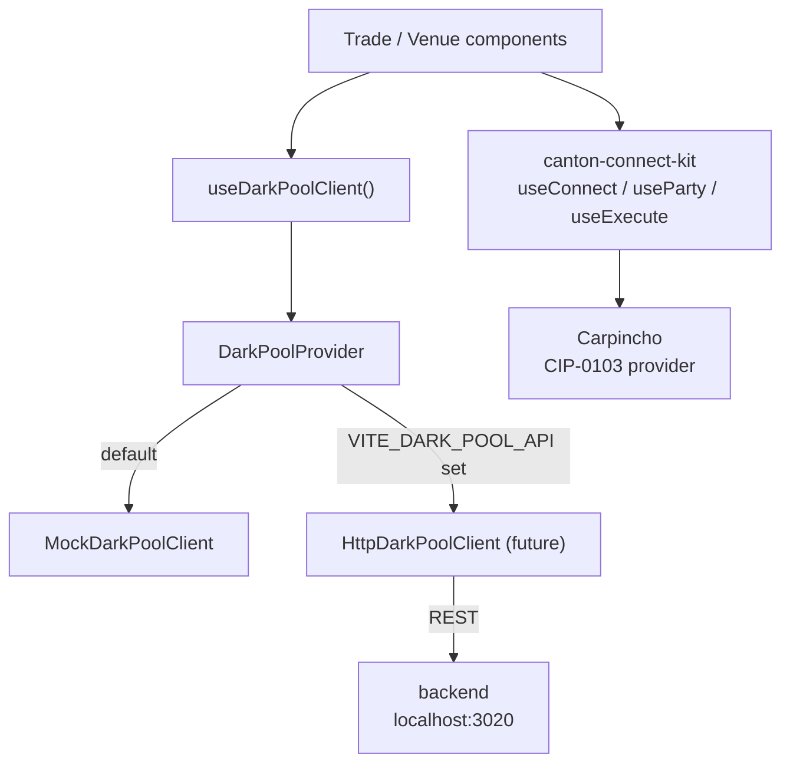

# Architecture Overview — frontend

The trading dApp. Built with Vite + React 18 + Tailwind v4 + TanStack Router. Two views: trader (`/`) and venue (`/venue`). Both read from the same `DarkPoolClient` interface -- today a mock, eventually an HTTP client backed by `backend/`.

## Project Structure

```
src/
  darkpool/
    types.ts                  shared DarkPoolClient interface, Order, Fill, Pool, Balance types
    darkpoolMath.ts           pricing and matching arithmetic (tested)
    DarkPoolProvider.tsx      React context providing the active DarkPoolClient
    client/
      MockDarkPoolClient.ts   in-browser dark pool simulation
      simEngine.ts            background engine that seeds counterparties and runs matching
  features/
    trade/                    trader view (/) -- order form, open orders, fills, balances
    venue/                    venue view (/venue) -- full book, match trigger, schedule
  components/                 shared UI primitives (Avatar, Badge, Dialog, etc.)
  routes/                     TanStack Router route definitions
  main.tsx                    app entry point
test/
  ts-resolver.mjs             tsx loader for node:test
  *.test.ts / *.test.tsx      unit tests (darkpoolMath, mock client, components)
```

## Data Flow



## Key Abstractions

### `DarkPoolClient`

`src/darkpool/types.ts` defines the interface. The provider, components, and tests all talk to this interface only -- never to a concrete client. Swapping mock for HTTP is a one-file change in `DarkPoolProvider.tsx`.

### `MockDarkPoolClient`

`src/darkpool/client/MockDarkPoolClient.ts` maintains an in-memory order book seeded with demo counterparties. `simEngine.ts` drives it on a timer, running placements, cancellations, and matches so the UI has live data without any backend.

### Routing

TanStack Router with file-based routes. Two routes: `/` (trader) and `/venue` (operator). The venue route is not linked from the navigation bar; it must be reached by direct URL.

### Wallet Connection

All Canton wallet interactions go through `canton-connect-kit` (a workspace package). The `ConnectKitProvider` wraps the app root and exposes hooks:

| Hook | Used for |
|------|---------|
| `useConnect` | connect / disconnect lifecycle |
| `useParty` | current party and connection status |
| `useWalletStatus` | lock/connect state |
| `useExecute` | submit Daml transactions |

## Switching to the Live Backend

1. Set `VITE_DARK_POOL_API=http://localhost:3020` in `frontend/.env.local`.
2. Implement `HttpDarkPoolClient` in `src/darkpool/client/HttpDarkPoolClient.ts` (see `backend/README.md` §6 for the wiring guide).
3. In `DarkPoolProvider.tsx`, instantiate `HttpDarkPoolClient` when `import.meta.env.VITE_DARK_POOL_API` is set.

The rest of the app is unaffected -- components only see the `DarkPoolClient` interface.
